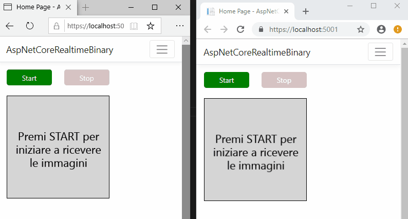

# ASP.NET Core Realtime Binary demo (con fuzionalità Start/Stop)
Questa è un'applicazione ASP.NET Core che dimostra come usare ASP.NET Core SignalR per fare push di contenuti binari dal server verso i client connessi. I client hanno la facoltà di avviare/arrestare l'invio dei contenuti.

## Requisiti
È necessario avere installato .NET Core SDK 2.2. L'applicazione è stata creata con Visual Studio Code ma può essere eseguita anche da Visual Studio 2017 o superiore.

## Panoramica
Nell'applicazione c'è un _hosted service_ che ogni secondo genera un'immagine PNG che reca l'ora corrente e un colore di sfondo casuale. L'immagine così generata viene inviata ai client connessi grazie a un _hub_ di ASP.NET Core SignalR, configurato per sfruttare il trasporto binario [MessagePack](https://msgpack.org/).

L'invio delle immagini avviene solo se è stato cliccato un apposito **bottone Start**, e può essere interrotta con un **bottone Stop**. Attenzione! In questa demo, il cambiamento di stato (da _started_ a _stopped_ o viceversa) ha effetto su tutti i client connessi, come si vede in questa immagine.

Questa demo prende spunto da questa pagina della documentazione ufficiale.
[https://docs.microsoft.com/it-it/aspnet/core/signalr/messagepackhubprotocol?view=aspnetcore-2.2](https://docs.microsoft.com/it-it/aspnet/core/signalr/messagepackhubprotocol?view=aspnetcore-2.2)

L'esecuzione di attività in background per mezzo di _hosted service_ è anche descritto qui:
[https://docs.microsoft.com/it-it/aspnet/core/fundamentals/host/hosted-services?view=aspnetcore-2.2](https://docs.microsoft.com/it-it/aspnet/core/fundamentals/host/hosted-services?view=aspnetcore-2.2)

## Guida passo-passo
 1. L'applicazione è stata creata con il comando `dotnet new mvc`. Sono state rimosse parti superflue ai fini della demo, tipo jQuery, la barra dei cookie e la pagina privacy;

 2. Aggiunto il pacchetto NuGet `Microsoft.AspNetCore.SignalR.Protocols.MessagePack` che si porta dietro come dipendenze anche i necessari pacchetti di SignalR;

 3. (Opzionale) Aggiunto il pacchetto NuGet `SkiaSharp` usato per generare l'immagine (nel vostro caso potrebbe non essere necessario generare l'immagine, ad esempio se viene prodotta da qualche altra fonte, come una webcam);
 
 4. Aggiunto il pacchetto NuGet `Nito.AsyncEx` usato come supporto per realizzare la funzionalità Start/Stop in maniera asincrona nel file [Models/Services/Infrastructure/TaskStartStop.cs](Models/Services/Infrastructure/TaskStartStop.cs);

 5. Creata la classe [Hubs/ImageStreamHub.cs](Hubs/ImageStreamHub.cs) che è l'_hub_ di ASP.NET Core SignalR usato per inviare dati binari ai client;
     * L'_hub_ contiene i metodi _Start_ e _Stop_ che saranno invocati dai client JavaScript;
     * L'_hub_ traccia connessioni e disconnessioni dei client. In questo modo, alla connessione di un client può inviargli lo stato corrente (_started_ o _stopped_), così che l'interfaccia HTML sia coerente con lo stato attuale del sistema. Inoltre, alla disconnessione, se non ci sono più client connessi fa uno _Stop_ automatico per evitare sprechi di risorse;
     * Ogni qualvolta lo stato cambia (da _started_ a _stopped_ o viceversa), notifica i client di questo cambiamento.

 6. Creata anche l'interfaccia [Hubs/IImageStreamClient.cs](Hubs/IImageStreamClient.cs) che viene implementata dall'_hub_ in modo che si possa invocare la funzione JavaScript sul client in maniera fortemente tipizzata;
 
 7. Creato l'_hosted service_ [HostedServices/ImageGenerator.cs](HostedServices/ImageGenerator.cs) che in questa demo serve a generare un'immagine ogni secondo.
    > Un _hosted service_ è un componente che va in esecuzione all'avvio dell'applicazione ASP.NET Core e viene arrestato al termine, consentendo di eseguire logica in background e indipendentemente dalle richieste HTTP in ingresso.
    * L'_hosted service_ di questa demo deriva da `BackgroundService` che ci semplifica quando dobbiamo eseguire attività in background come in questo caso. Inoltre, nel suo costruttore riceve il servizio `IHubContext<ImageStreamHub, IImageStreamClient>` che rappresenta l'_hub_ di ASP.NET Core SignalR e un nostro servizio `ITaskStartStop` che usa per determinare se lo stato corrente è _Start_;
    * Il metodo `ExecuteAsync` dell'_hosted service_ viene richiamato automaticamente all'avvio dell'applicazione e resta in funzione finché l'applicazione è in esecuzione. Se lo stato corrente è _Start_, allora ogni secondo genera un'immagine grazie alla libreria `SkiaSharp` ([documentata qui da Microsoft](https://docs.microsoft.com/en-us/dotnet/api/skiasharp));
    * L'immagine così generata viene salvata in memoria in formato PNG e i suoi byte sono inviati al client grazie al suddetto servizio `IHubContext<ImageStreamHub, IImageStreamClient>`.

 8. Creato il file [Models/Services/Infrastructure/TaskStartStop.cs](Models/Services/Infrastructure/TaskStartStop.cs) che definisce il servizio per avviare o arrestare l'invio delle immagini.
    * Il servizio è thread-safe perché più client connessi potrebbero richiedere contemporaneamente lo _Start_ o lo _Stop_ dell'invio. In questa semplice demo, **la pressione di uno dei bottoni influenzerà tutti i client connessi**.
    * Il servizio espone il metodo `ShouldExecute` che viene usato dall'_hosted service_ per capire se deve generare o no le immagini e inviarle ai client. Questo metodo è asincrono e restituisce un valore `true` se lo stato è _Started_ e restituisce `false` quando l'applicazione viene arrestata. Altrimenti, finché lo stato è _Stopped_ comporterà un'attesa indefinita per l'_hosted service_, costringendolo di fatto a non inviare immagini.
     > In uno scenario più complesso, potrebbe essere preferibile avviare/arrestare il `Task` in corrispondenza delle operazioni di _Start_ e _Stop_, anziché tenerlo in attesa come in questo esempio. Questo è consigliato soprattutto se i `Task` devono essere molti, come nel caso di più fonti produttrici di immagini, oppure di contenuti personalizzati per client.

 9. Nella view [Views/Home/Index.cshtml](Views/Home/Index.cshtml) è stato aggiunto del codice JavaScript:
    * Sono stati aggiunti i riferimenti a 3 librerie JavaScript (signalr, msgpack5, signalr-protocol-msgpack). Si è configurata la connessione all'hub usando MessagePack come tipo di trasporto per poter ricevere dati binari con ASP.NET Core SignalR in maniera ottimizzata;
    * Ci sono due bottoni, _Start_ e _Stop_ che consentono di avviare o fermare la ricezione delle immagini;
    * Alla ricezione dei dati binari dell'immagine, che si manifestano nel client con un [oggetto Uint8Array](https://developer.mozilla.org/en-US/docs/Web/JavaScript/Reference/Global_Objects/Uint8Array), è stato creato un [oggetto Blob](https://developer.mozilla.org/en-US/docs/Web/API/Blob) e poi usato il [metodo URL.createObjectURL](https://developer.mozilla.org/en-US/docs/Web/API/URL/createObjectURL) per ottenere un URL che si possa assegnare alla proprietà `src` di un elemento `img`, così che l'utente possa vedere l'immagine.
    * Quando il server invia una nuova immagine, l'URL ottenuto in precedenza viene deallocato con il [metodo URL.revokeObjectURL](https://developer.mozilla.org/en-US/docs/Web/API/URL/revokeObjectURL)  per evitare un memory leak.

 10. Infine, si sono registrati il middleware e i servizi dalla classe [Startup.cs](Startup.cs):
     * Dal metodo `Configure` si è aggiunto il middleware di ASP.NETCore SignalR, indicando il tipo e l'endpoint dell'_hub_. Inoltre,è stato indicato il peso massimo che l'immagine può averedall'opzione `ApplicationMaxBufferSize`;
     * Dal metodo `ConfigureServices` si è aggiunto il servizio diASP.NET Core SignalR, indicando MessagePack come trasporto;
     * Sempre dal metodo `ConfigureServices` sono stati aggiunti anchel'_hosted service_ responsabile della generazione dell'immagine el'`ITaskStartStop` che contiene la logica per realizzare lafunzionalità di _Start_ e _Stop_.